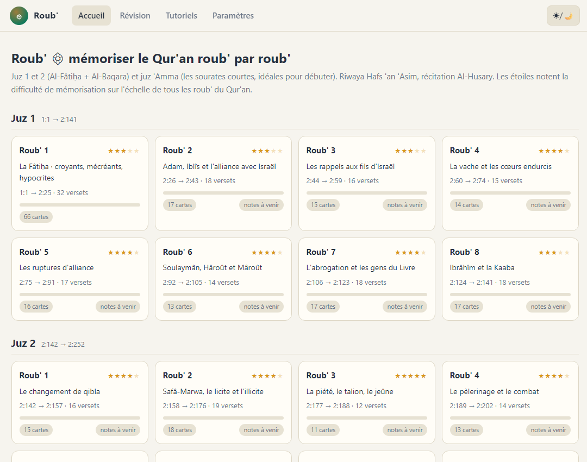
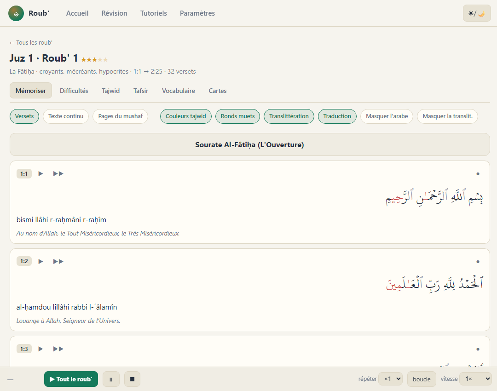
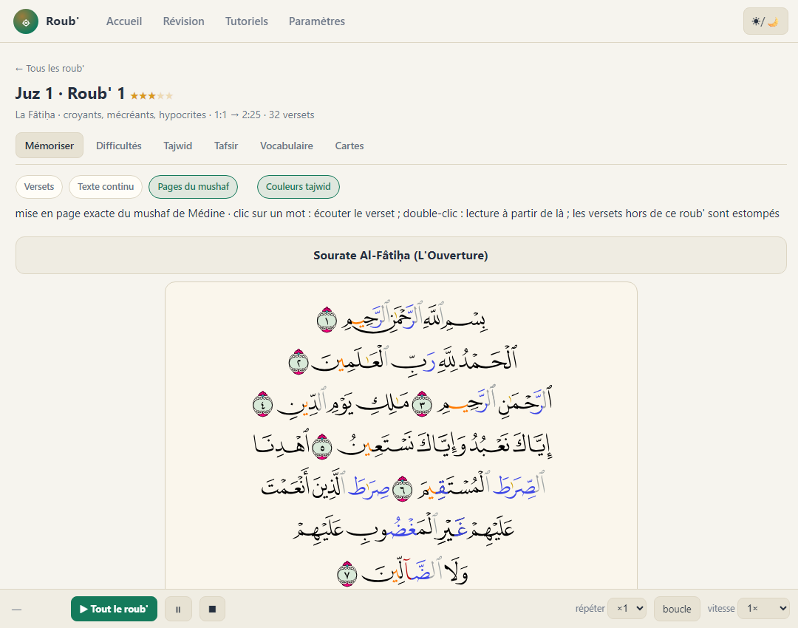
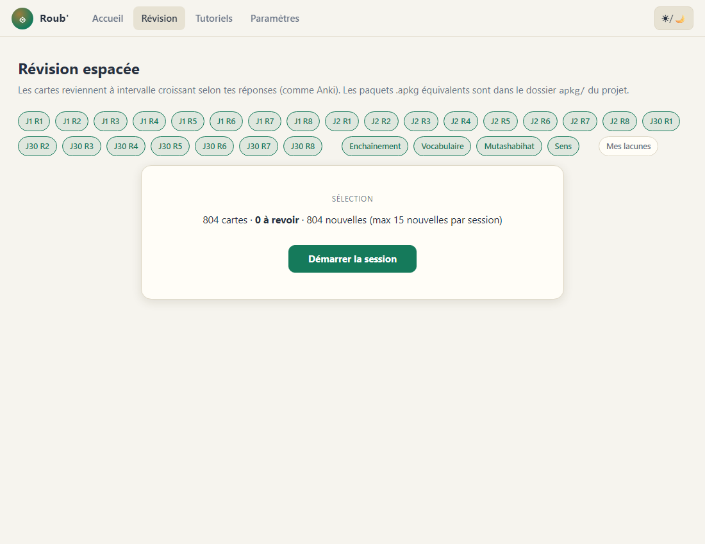

# Roub' ۞ mémoriser le Qur'an roub' par roub'

**Application web : https://yusuf-oph.github.io/roub/**

Roub' (رُبْع, « le quart ») aide à mémoriser le Qur'an en suivant le
découpage traditionnel du mushaf : le roub'. Couverture actuelle : **juz 1
et 2** (Al-Fâtiḥa + Al-Baqara) et **juz 'Amma** (les sourates courtes,
idéales pour débuter), soit 24 roub' et 823 versets.

Pour chaque roub' : texte du mushaf de Médine colorié tajwid, **pagination
exacte du mushaf** (calligraphie officielle QCF, en noir et blanc ou en
édition colorée tajwid), translittération à double style (hybride
française / scientifique), traduction Hamidullah, audio Al-Husary verset
par verset, difficulté notée sur 5 étoiles, difficultés de mémorisation,
particularités tajwid reliées à des fiches de règles, tafsir sourcé
(Ibn Kathîr, As-Sa'dî), vocabulaire, **révision espacée** intégrée
(+ paquets Anki), progression visible, auto-évaluation des lacunes et
**synchronisation multi-appareils par code anonyme**. PWA installable,
fonctionne hors-ligne.

## Qui sommes-nous

- **Anis** : co-fondateur, docteur en mathématiques. À l'origine de la
  méthode : le déroulé roub' par roub', la difficulté étoilée, les cartes
  façon Anki, les listes de difficultés de mémorisation, les
  particularités tajwid, les rappels de règles, le tafsir et le
  vocabulaire.
- **Yusuf** : co-fondateur, interne en médecine. Conception et
  réalisation, et les idées qui vont autour : translittération
  scientifique stricte ou hybride au choix, distribution web et PWA,
  synchronisation par code anonyme (Supabase), auto-évaluation,
  affichage de la progression. Discord : **@ophtalmologie**.
- **Israa** : conseillère pédagogique, ostéopathe. L'idée du parcours
  tajwid progressif : découvrir peu de règles à la fois, sourate après
  sourate.

Tout le contenu religieux (tafsir, hadiths, règles de tajwid, texte) est
sourcé et vérifié contre ses sources ; une erreur reste toujours possible :
merci de la signaler. **Avis, bugs, suggestions : dev.yusuf@pm.me** (ou
l'export d'avis intégré à l'application, dans Paramètres).

## Utiliser

- **En ligne (recommandé)** : ouvrir l'URL ci-dessus. « Ajouter à l'écran
  d'accueil » pour l'installer comme une application ; Paramètres →
  « Tout précharger » pour un hors-ligne complet ; les mises à jour sont
  automatiques (bannière en haut de page).
- **En local, sans serveur** : Code → Download ZIP sur cette page GitHub,
  dézipper, ouvrir `app/index.html` (ou `start.bat` sous Windows avec
  Python). Tout fonctionne, audio compris ; l'application signale
  lorsqu'une version plus récente est en ligne.

### L'accueil : les 24 roub' et leur difficulté

### Mémoriser : tajwid colorié, translittération, traduction, audio

### Les vraies pages du mushaf de Médine (édition colorée tajwid)

### Révision espacée intégrée

## Sources et licences

- **Code : AGPL-3.0** (fichier `LICENSE`) · **Contenu éditorial :
  CC BY-NC-SA 4.0** : détails (français et anglais) dans
  `LICENSE-CONTENU.md`.
- Texte coranique : mushaf de Médine, Complexe du Roi Fahd (KFGQPC), via
  l'API quran.com ; polices UthmanicHafs et QCF du KFGQPC.
- Traduction française : Muhammad Hamidullah.
- Récitation : Mahmoud Khalil Al-Husary (everyayah.com), usage non
  commercial.
- Tafsir : synthèses rédigées, sourcées d'Ibn Kathîr (Tafsîr al-Qur'ân
  al-'Adhîm) et d'As-Sa'dî (Taysîr al-Karîm ar-Rahmân) ; règles de tajwid
  d'après Tuhfat al-Atfal et al-Muqaddima al-Jazariyya.

Application gratuite et non commerciale, sans compte ni collecte de
données personnelles ; la synchronisation optionnelle repose sur un code
secret anonyme. © 2026 Anis & Yusuf.

Développement et maintenance : voir `tools/README.md`.
