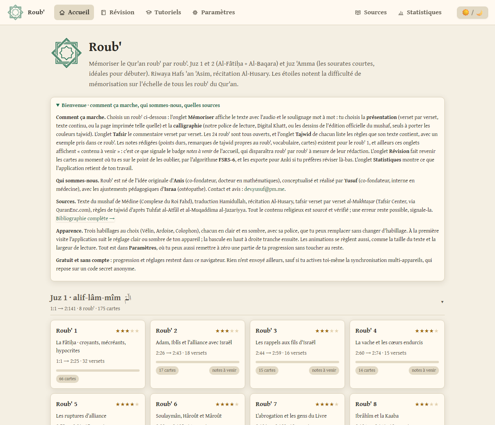
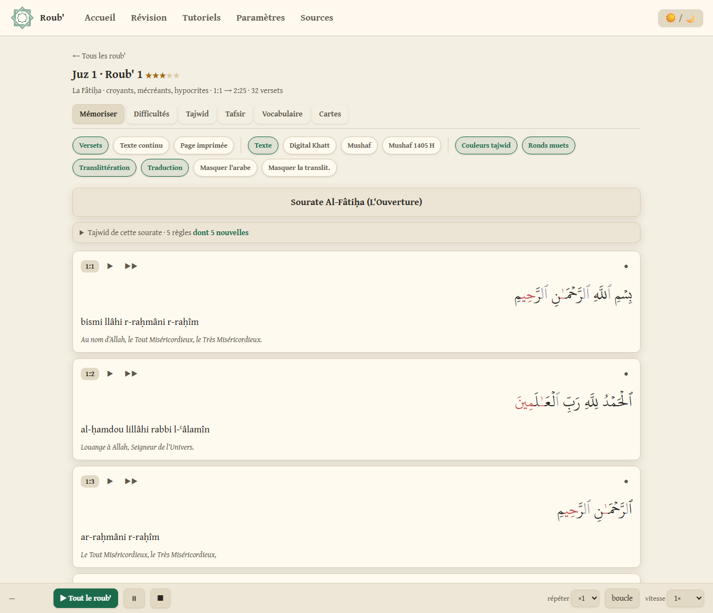
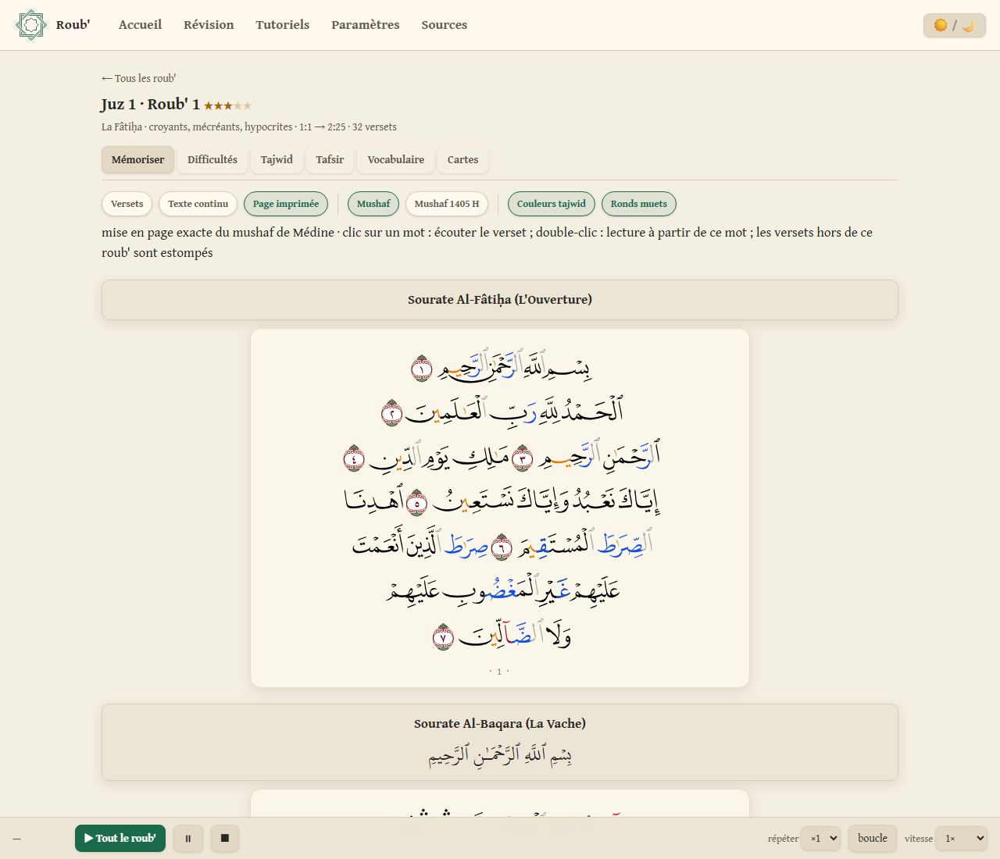
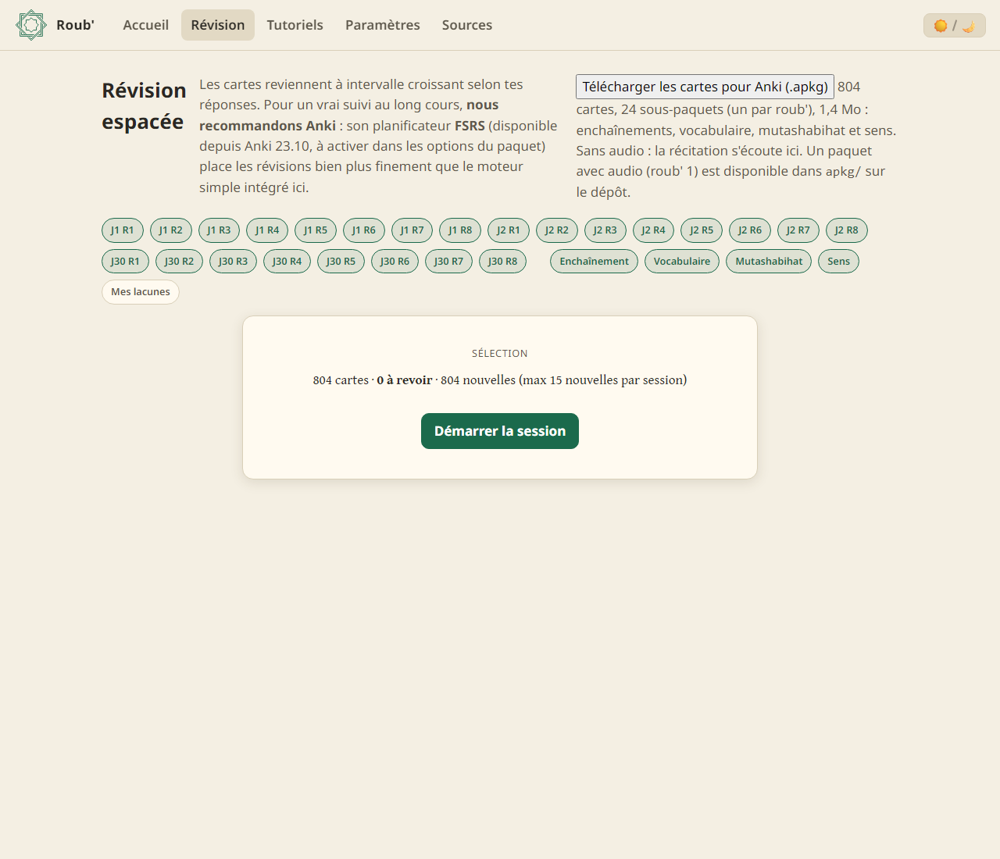

# Roub' ۞ mémoriser le Qur'an roub' par roub'

**Application web : https://yusuf-oph.github.io/roub/**

Roub' (رُبْع, « le quart ») aide à mémoriser le Qur'an en suivant le
découpage traditionnel du mushaf : le roub'. Couverture actuelle : **juz 1
et 2** (Al-Fâtiḥa + Al-Baqara) et **juz 'Amma** (les sourates courtes,
idéales pour débuter), soit 24 roub' et 823 versets.

Pour chaque roub' : texte du mushaf de Médine colorié tajwid, **pagination
exacte du mushaf** (calligraphie officielle QCF, en noir et blanc ou en
édition colorée tajwid), translittération à double style (hybride
française / scientifique), traduction Hamidullah, audio Al-Husary verset
par verset, difficulté notée sur 5 étoiles, difficultés de mémorisation,
particularités tajwid reliées à des fiches de règles, **tafsir verset par
verset** (al-Mukhtaṣar, traduction française), vocabulaire, **révision
espacée** intégrée (et export des cartes pour Anki, planificateur FSRS),
**surlignage mot à mot** de la récitation dans quatre styles au choix,
progression visible, auto-évaluation des lacunes et
**synchronisation multi-appareils par code anonyme**. PWA installable,
fonctionne hors-ligne.

## Qui sommes-nous

- **Anis** (co-fondateur, docteur en mathématiques) : à l'origine de la
  méthode.
- **Yusuf** (co-fondateur, interne en médecine) : conception et
  réalisation. Discord : **@ophtalmologie**.
- **Israa** (ostéopathe) : conseillère pédagogique.

Tout le contenu religieux (tafsir, hadiths, règles de tajwid, texte) est
sourcé et vérifié contre ses sources ; une erreur reste toujours possible :
merci de la signaler. Le tafsir verset par verset est la « French
Translation of Al-Mukhtasar in Interpreting the Noble Quran » (Tafsir
Center for Quranic Studies, V1.0.0, via QuranEnc.com), reproduite sans
modification. **Avis, bugs, suggestions : dev.yusuf@pm.me** (ou
l'export d'avis intégré à l'application, dans Paramètres).

## Utiliser

- **En ligne (recommandé)** : ouvrir l'URL ci-dessus. « Ajouter à l'écran
  d'accueil » pour l'installer comme une application. Le texte, les notes,
  le tafsir et l'interface sont gardés hors-ligne dès la première visite ;
  l'audio et les pages du mushaf se préchargent **à la carte** dans
  Paramètres, chaque style de récitation séparément. Mises à jour
  automatiques (bannière en haut de page).
- **En local, sans serveur** : Code → Download ZIP sur cette page GitHub,
  dézipper, ouvrir `app/index.html` (ou `start.bat` sous Windows avec
  Python). Tout fonctionne, audio compris ; l'application signale
  lorsqu'une version plus récente est en ligne.

### L'accueil : les 24 roub' et leur difficulté

### Mémoriser : tajwid colorié, translittération, traduction, audio

### Les vraies pages du mushaf de Médine (édition colorée tajwid)

### Révision espacée intégrée

## Sources et licences

- **Code : AGPL-3.0** (fichier `LICENSE`) · **Contenu éditorial :
  CC BY-NC-SA 4.0** : détails (français et anglais) dans
  `LICENSE-CONTENU.md`.
- Texte coranique : mushaf de Médine, Complexe du Roi Fahd (KFGQPC), via
  l'API quran.com ; polices UthmanicHafs et QCF du KFGQPC.
- Traduction française : Muhammad Hamidullah.
- Récitation : Mahmoud Khalil Al-Husary, quatre styles au choix : murattal
  64 kbps fourni avec l'appli, murattal 128 kbps et muallim via
  everyayah.com, mujawwad via le CDN de Tarteel ; les styles non embarqués
  se mettent en cache au fil de l'écoute. Usage non commercial.
- Surlignage mot à mot : segments de la Quranic Universal Library
  (qul.tarteel.ai), un jeu par style.
- Tafsir : « French Translation of Al-Mukhtasar in Interpreting the Noble
  Quran », Tafsir Center for Quranic Studies, V1.0.0, via QuranEnc.com,
  reproduit sans modification (conditions de QuranEnc.com).
- Notes, cartes et tutoriels : sources citées au fil du texte (Ibn Kathîr,
  As-Sa'dî, Ibn al-Jazarî) ; fiches de règles d'après les matns Tuhfat
  al-Atfal et al-Muqaddima al-Jazariyya.

Application gratuite et non commerciale, sans compte ni collecte de
données personnelles ; la synchronisation optionnelle repose sur un code
secret anonyme. © 2026 Anis & Yusuf.

Développement et maintenance : voir `tools/README.md`.
